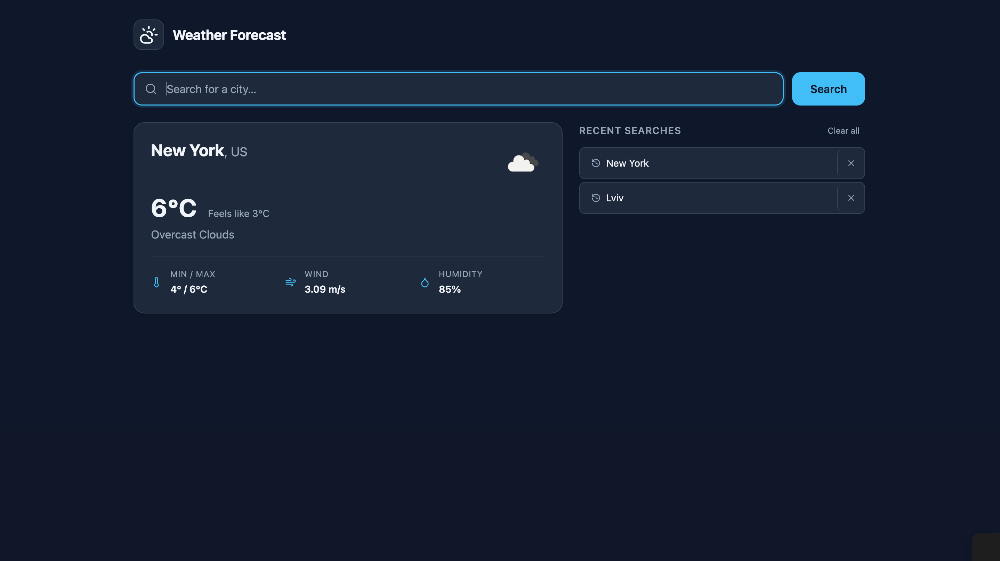

# Weather Forecast App

A production-quality weather forecast application built with React and TypeScript. Search any city to see live weather data — temperature, conditions, wind, and humidity — with a persistent, undoable search history.


**[Live Demo](https://dmitriymuliak.github.io/cars-tt/)**

## Prerequisites

| Tool | Version |
|---|---|
| Node.js | ≥ 20.0.0 |
| pnpm | ≥ 9.0.0 |

Install pnpm if needed:
```bash
npm install -g pnpm
```

## Setup

```bash
# 1. Clone the repository
git clone https://github.com/DmitriyMuliak/cars-tt.git
cd cars-tt

# 2. Copy environment file and add your API key
cp .env.example .env
# Edit .env and set VITE_OPENWEATHER_API_KEY
# Get a free key at https://openweathermap.org/api

# 3. Install dependencies
pnpm install

# 4. Start the development server
pnpm dev
```

Open [http://localhost:5173](http://localhost:5173) in your browser.

## Scripts

| Command | Description |
|---|---|
| `pnpm dev` | Start development server (Vite HMR) |
| `pnpm build` | Type-check and build for production |
| `pnpm preview` | Preview the production build |
| `pnpm lint` | Run ESLint (includes import-order check) |
| `pnpm format` | Format source files with Prettier |
| `pnpm test` | Run unit tests (single run) |
| `pnpm test:watch` | Run unit tests in watch mode |
| `pnpm test:coverage` | Run unit tests with V8 coverage report |
| `pnpm test:e2e` | Run Playwright end-to-end tests |
| `pnpm test:e2e:ui` | Open Playwright interactive UI |

## Architecture

The project uses a **feature-based** folder structure. Code is grouped by domain feature first, with shared infrastructure extracted into `shared/`.

```
src/
  features/
    citySearch/
      components/   # SearchBar, WeatherCard, SearchHistory, HistoryItem, UndoToastContent
      hooks/        # useWeatherQuery — TanStack Query wrapper
                    # useHistoryActions — remove/clear/undo orchestration
      store/        # citySearchStore — history + activeCity + undo buffer
  shared/
    api/            # fetchWeather, ApiError, getWeatherIconUrl
    components/
      ui/
        Button/     # Reusable button with variants (primary, ghost, ghost-danger, …)
        Toast/      # Single toast item with auto-dismiss timer
      ErrorBoundary/
      Toaster/      # Toast container (reads from toastStore)
    config/         # getEnvVars — validates required env vars at startup
    hooks/          # useToast — imperative toast trigger
                    # useDelayedLoading — debounced loading flag
    store/          # toastStore
    types/          # Shared TypeScript interfaces (WeatherData, CityHistory, …)
    utils/          # formValidator
  test/             # Vitest global setup, MSW server, shared test utilities
  App.tsx           # Root layout
  main.tsx          # React + QueryClient bootstrap
tests/
  e2e/              # Playwright specs (search, history, undo, error states)
```

### State management

**Zustand** manages two concerns:

1. **Search history** — persisted to `localStorage` via Zustand's `persist` middleware. Only the `history` array is serialised; ephemeral state (`lastRemovedItems`, `activeCity`) lives in memory only.
2. **Undo buffer** — `lastRemovedItems` stores the snapshot of what was just deleted, giving the undo toast everything it needs to restore state.

**TanStack Query** owns all server state. The `useWeatherQuery` hook wraps `useQuery` with a 5-minute `staleTime` and a single retry, so the UI never makes redundant network calls and recovers gracefully from transient failures.

## Design decisions

### Why Zustand over React Context?
The primary reason is **separation of concerns**, not render optimisation.

The `SearchHistory` list will re-render on every history change regardless of which state manager is used — that is unavoidable because the list itself changes. What Zustand buys is a clean boundary between global state (history, active city, undo buffer) and component logic. Each component subscribes to exactly the slice it needs via selectors; components that do not own any state stay stateless and testable in isolation.

Context is well-suited for genuinely static or rarely-changing values (theme, locale). For mutable global state that is written from multiple components, Context leads to prop-drilling, context-splitting boilerplate, or large provider trees — all of which Zustand avoids with its flat, store-based API.

### Why TanStack Query for a single API call?
Implementing caching, deduplication, and loading/error state manually with `useEffect` + `useState` is error-prone boilerplate. TanStack Query gives these for free: identical concurrent requests are deduplicated, results are cached for 5 minutes so navigating back to a searched city costs zero network requests, and loading/error states are derived automatically. The `onSuccess` callback also provides a clean integration point to write into Zustand (`addToHistory`) without coupling the component to side-effect logic.

### Why Container Queries instead of Media Queries?
The app layout uses `@container` queries so components respond to *their own available width*, not the viewport. This makes `WeatherCard` and `SearchHistory` genuinely reusable: drop them into any column width and they reflow correctly without needing new breakpoints.

### API error handling
The `ApiError` class carries an HTTP `statusCode`. The UI distinguishes between a 404 (city not found — actionable message) and other errors (generic fallback), avoiding user confusion.

### Testing strategy

- **Unit tests** (Vitest + RTL) cover all store logic, hooks, and component rendering at 90%+ statement coverage. Network calls are intercepted via **MSW** — no `fetch` mocking, no module mocking of React Query.
- **E2E tests** (Playwright) cover the full user journey: search, history interaction, undo, and error states.

## Environment variables

| Variable | Description |
|---|---|
| `VITE_OPENWEATHER_API_KEY` | OpenWeatherMap API key (required) |
